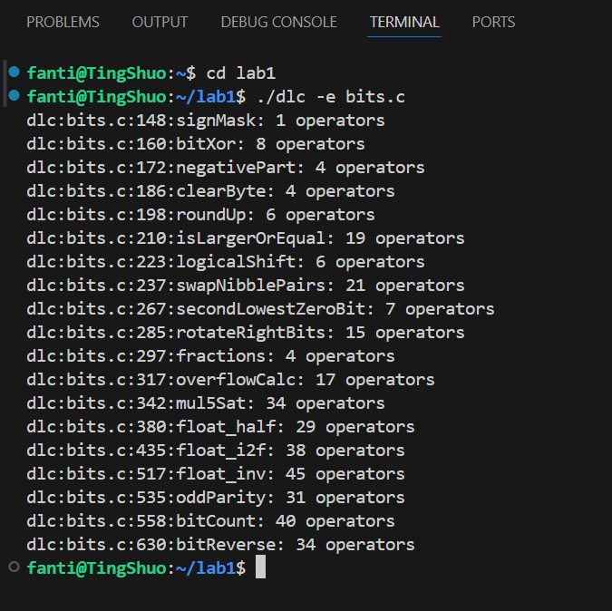
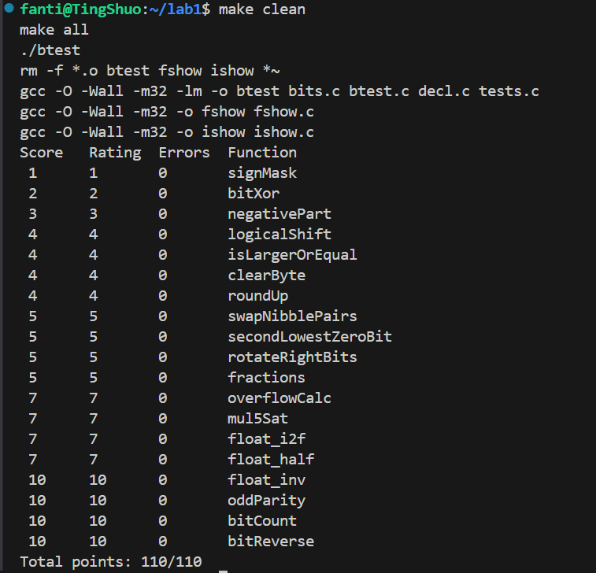

# CS:APP Data Lab 实验报告

**姓名**：范庭朔
**学号**：24300120171 
**课程名称**：计算机系统基础（CS:APP）  
**实验标题**：Data Lab：位运算与浮点数表示  
**提交文件**：`bits.c`、实验报告（本文件）  

---

## 一、实验截图

### 1. `dlc` 检查结果截图

> 运行命令：`./dlc -e bits.c`  
> 结果：合法（No errors detected）



---

### 2. `btest` 测试结果截图

> 运行命令：`./btest`  
> 结果：All tests passed ✅



---

## 二、函数设计与思路说明

以下对 `bits.c` 中每个题目的核心思路进行说明。

---

### P1. `signMask`

返回最高位掩码 `0x80000000`  
**思路**：将 1 左移 31 位即可。
```c
return 1 << 31;
```


### P2. `bitXor`

用 `~` 与 `&` 实现 `^`。
**思路**：利用德摩根律展开异或逻辑：
`x ^ y = ~(~(~x & y) & ~(x & ~y))`

---

### P3. `negativePart`

返回负数的相反数，否则返回 0。
**思路**：利用符号位扩展 `x >> 31` 构造掩码。

---

### P4. `clearByte`

清空第 n 个字节。
**思路**：构造 `~(0xFF << (n << 3))` 掩码并与原数相与。

---

### P5. `roundUp`

将数向上取整为 256 的倍数。
**思路**：右移 8 位判断余数是否非零，利用 `!!(x & 0xFF)`。

---

### P6. `isLargerOrEqual`

判断 `x >= y`。
**思路**：

* 若符号相同，判断 `x - y` 的符号；
* 若符号不同，直接根据符号位判断。

---

### P7. `logicalShift`

逻辑右移。
**思路**：普通右移后清除符号扩展部分，用掩码
`~(((1 << 31) >> n) << 1)` 保留低位。

---

### P8. `swapNibblePairs`

交换每字节的高低 4 位。
**思路**：分离高低 4 位，左移和右移互换再合并。

---

### P9. `secondLowestZeroBit`

返回第二个最低的 0 位掩码。
**思路**：先找最低 0 位 (~x & (x+1))，再将其置 1 后重复操作。

---

### P10. `rotateRightBits`

循环右移。
**思路**：

* 低位移出部分左移至高位；
* 高位部分逻辑右移；
* 再将二者或运算合并。

---

### P11. `fractions`

计算 `floor((x*5 + 8)/16)`。
**思路**：位移代替乘除法：`x + (x << 2)` 为乘 5，`>>4` 为除 16。

---

### P12. `overflowCalc`

计算三个正整数相加的溢出位。
**思路**：利用加法器的进位传播公式 `(x & y) | ((x | y) & ~sum)`。

---

### P13. `mul5Sat`

计算 `x*5` 并在溢出时饱和到 `INT_MAX/MIN`。
**思路**：

* 检查每步移位或加法溢出；
* 分别返回上溢/下溢结果。

---

### P14. `float_half`

浮点数除以 2。
**思路**：

* 指数域大于 1 → 直接减 1；
* 次正规数或指数为 0 → 右移 fraction，注意舍入。

---

### P15. `float_i2f`

整数转浮点数。
**思路**：

* 找最高 1 位确定指数；
* 构造 fraction 并处理舍入；
* 特判 `x=0` 与 `x=INT_MIN`。

---

### P16. `float_inv`

计算浮点数形式的 `1/x`。
**思路**：

* 先提取符号与绝对值；
* 模拟二进制长除法生成 23 位尾数；
* 实现“最近舍入偶数”规则。

---

### P17. `oddParity`

判断 1 的个数是否为偶数。
**思路**：

* 逐级异或折叠；
* 若最终为 0 → 偶数个 1 → 返回 1。

---

### P18. `bitCount`

统计 1 的数量。
**思路**：

* 分治掩码法，依次两位、四位、八位合并求和。

---

### P19. `bitReverse`

反转所有位。
**思路**：

* 构造五层掩码（`m1,m2,m4,m8,m16`）；
* 通过移位与掩码逐层交换位组。
* 经过实验, 选择改良m8, m4的效果最佳 (op最少)

---

## 三、实验感想

* pdf也放在了文件夹中
* PS: 板块二中所提到的思路只是最为简化的思路，若助教想要了解更为详细的思路，请移步bits.c文档的注释（我在文档中，对于文档后半部分的难题，做了详细的注释，解释了函数实现的核心思路以及每行代码的作用）
* 这次实验的难度相当之高，总共花了3天多的时间才把题目全部做对，有些题还需要GPT帮我去理解提示才能做出，做的时候感觉很累很累，希望下次能稍微降低一下题量和题目难度

---

## 七、对助教的建议（可选）

* 若能在实验指导中附上每道题的核心提示（可选择做成一个可打开可隐藏的窗口）会更利于同学做题
