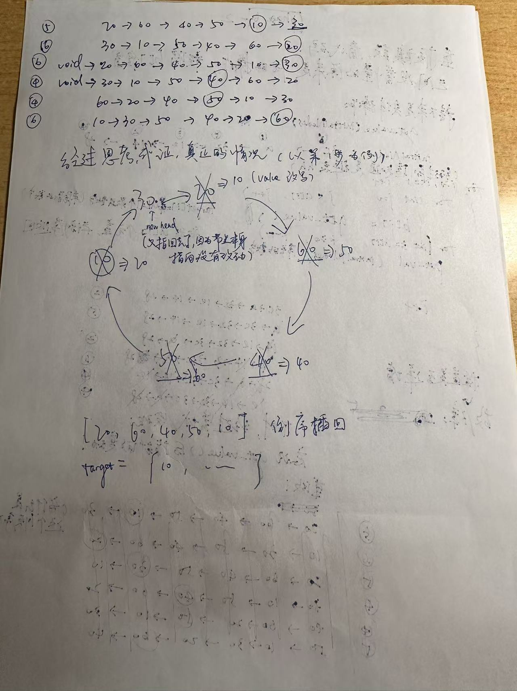

# 拆弹之旅
姓名:范庭朔
学号:24300120171
身份:Pacifist

# 拆弹成功截图

(文档后部分含有TE截图，94分)

# 特别注意
助教若需要运行验证，只需进入lab2/bomb目录，运行 
./bomb++ < password.txt
即可

此外，我的password.txt最后必须要一个换行符才能运行成功输出最终结果，希望助教不要因此扣分，实测可以运行

以下简单介绍我的拆弹思路
# phase_1

代码分析：
   81958:	f3 0f 1e fa          	endbr64
   8195c:	55                   	push   %rbp
   8195d:	48 89 e5             	mov    %rsp,%rbp
   81960:	53                   	push   %rbx
   81961:	48 81 ec 48 02 00 00 	sub    $0x248,%rsp
   81968:	48 89 bd b8 fd ff ff 	mov    %rdi,-0x248(%rbp)           // 把用户输入rdi存入 -0x248(%rbp)
   //  主要在做预处理

   8196f:	8b 0d bb 9f 42 00    	mov    0x429fbb(%rip),%ecx        # 4ab930 <ID_hash>
   81975:	89 ca                	mov    %ecx,%edx
   81977:	b8 cd cc cc cc       	mov    $0xcccccccd,%eax
   8197c:	48 0f af c2          	imul   %rdx,%rax
   81980:	48 c1 e8 20          	shr    $0x20,%rax
   81984:	89 c2                	mov    %eax,%edx
   81986:	c1 ea 03             	shr    $0x3,%edx
   81989:	89 d0                	mov    %edx,%eax
   8198b:	c1 e0 02             	shl    $0x2,%eax
   8198e:	01 d0                	add    %edx,%eax
   81990:	01 c0                	add    %eax,%eax
   81992:	29 c1                	sub    %eax,%ecx                 // 通过巧妙算法实现x%10的简便运算

   81994:	89 ca                	mov    %ecx,%edx
   81996:	b8 d6 00 00 00       	mov    $0xd6,%eax
   8199b:	29 d0                	sub    %edx,%eax
   8199d:	89 05 b1 9f 42 00    	mov    %eax,0x429fb1(%rip)        # 4ab954 <phase_1_offset>
   819a3:	8b 05 ab 9f 42 00    	mov    0x429fab(%rip),%eax        # 4ab954 <phase_1_offset>   // 得到一个offset

   819a9:	48 98                	cltq
   819ab:	48 8d 15 6e 76 42 00 	lea    0x42766e(%rip),%rdx        # 4a9020 <phase_1_str>
   819b2:	48 01 d0             	add    %rdx,%rax
   819b5:	48 89 45 e0          	mov    %rax,-0x20(%rbp)
   819b9:	48 8b 45 e0          	mov    -0x20(%rbp),%rax
   819bd:	48 89 45 d8          	mov    %rax,-0x28(%rbp)             // 得到一个str的首地址位置

   819c1:	c7 45 ec 00 00 00 00 	movl   $0x0,-0x14(%rbp)         // 初始化 sum
   819c8:	c7 45 e8 00 00 00 00 	movl   $0x0,-0x18(%rbp)         // 初始化 i
   819cf:	eb 21                	jmp    819f2 <phase_1+0x9a>     // 进入判断循环条件

// 跳到819f2

   819f2:	8b 0d 38 9f 42 00    	mov    0x429f38(%rip),%ecx        # 4ab930 <ID_hash>
   819f8:	89 ca                	mov    %ecx,%edx
   819fa:	b8 cd cc cc cc       	mov    $0xcccccccd,%eax
   819ff:	48 0f af c2          	imul   %rdx,%rax
   81a03:	48 c1 e8 20          	shr    $0x20,%rax
   81a07:	89 c2                	mov    %eax,%edx
   81a09:	c1 ea 03             	shr    $0x3,%edx
   81a0c:	89 d0                	mov    %edx,%eax
   81a0e:	c1 e0 02             	shl    $0x2,%eax
   81a11:	01 d0                	add    %edx,%eax
   81a13:	01 c0                	add    %eax,%eax
   81a15:	29 c1                	sub    %eax,%ecx
   81a17:	89 ca                	mov    %ecx,%edx
   81a19:	8d 42 01             	lea    0x1(%rdx),%eax
   81a1c:	39 45 e8             	cmp    %eax,-0x18(%rbp)        // 判断 r%10+1 和 i 的大小，共循环 r%10+1次
   81a1f:	7c b0                	jl     819d1 <phase_1+0x79>    // 进入循环体语句执行

// 跳到819d1

   819d1:	8b 45 e8             	mov    -0x18(%rbp),%eax
   819d4:	48 63 d0             	movslq %eax,%rdx
   819d7:	48 8b 45 d8          	mov    -0x28(%rbp),%rax
   819db:	48 01 d0             	add    %rdx,%rax               // str首地址+i
   819de:	0f b6 00             	movzbl (%rax),%eax             // Move with Zero-Extend Byte to Long
   819e1:	88 45 d7             	mov    %al,-0x29(%rbp)
   819e4:	0f b6 45 d7          	movzbl -0x29(%rbp),%eax
   819e8:	0f b6 c0             	movzbl %al,%eax
   819eb:	01 45 ec             	add    %eax,-0x14(%rbp)        // 放入 sum
   819ee:	83 45 e8 01          	addl   $0x1,-0x18(%rbp)        // i += 1

   81a21:	8b 55 ec             	mov    -0x14(%rbp),%edx        // sum
   81a24:	48 8d 45 c0          	lea    -0x40(%rbp),%rax        // 一块temp_buff
   81a28:	48 8d 0d a1 dc 2c 00 	lea    0x2cdca1(%rip),%rcx        # 34f6d0 <_ZSt19piecewise_construct+0x6cc>
   81a2f:	48 89 ce             	mov    %rcx,%rsi
   81a32:	48 89 c7             	mov    %rax,%rdi
   81a35:	b8 00 00 00 00       	mov    $0x0,%eax
   81a3a:	e8 61 48 ff ff       	call   762a0 <sprintf@plt>     // 调用sprintf(temp_buff, format, sum)，将sum按照format写入temp_buff

   81a3f:	48 8d 55 c0          	lea    -0x40(%rbp),%rdx        // 写好数字的temp_buff
   81a43:	48 8d 85 c0 fd ff ff 	lea    -0x240(%rbp),%rax       // 一片更大的内存，称为out
   81a4a:	48 89 d6             	mov    %rdx,%rsi
   81a4d:	48 89 c7             	mov    %rax,%rdi
   81a50:	e8 eb 4b ff ff       	call   76640 <strcpy@plt>      // strcpy(out, temp_buff), 将temp_buff copy到 out

   81a55:	8b 0d d5 9e 42 00    	mov    0x429ed5(%rip),%ecx        # 4ab930 <ID_hash>
   81a5b:	89 ca                	mov    %ecx,%edx
   81a5d:	b8 cd cc cc cc       	mov    $0xcccccccd,%eax
   81a62:	48 0f af c2          	imul   %rdx,%rax
   81a66:	48 c1 e8 20          	shr    $0x20,%rax
   81a6a:	89 c2                	mov    %eax,%edx
   81a6c:	c1 ea 03             	shr    $0x3,%edx
   81a6f:	89 d0                	mov    %edx,%eax
   81a71:	c1 e0 02             	shl    $0x2,%eax
   81a74:	01 d0                	add    %edx,%eax
   81a76:	01 c0                	add    %eax,%eax
   81a78:	29 c1                	sub    %eax,%ecx
   81a7a:	89 ca                	mov    %ecx,%edx
   81a7c:	8d 42 01             	lea    0x1(%rdx),%eax        // 再次调用算法并+1，把 r+1 存入 rax
   81a7f:	89 c2                	mov    %eax,%edx
   81a81:	48 8b 45 e0          	mov    -0x20(%rbp),%rax      // 读取str首地址
   81a85:	48 8d 1c 02          	lea    (%rdx,%rax,1),%rbx    // 将 (r+1) + ptr + 1 存入 rbx
   81a89:	48 8d 45 c0          	lea    -0x40(%rbp),%rax      // 带有数字的temp_buff载入
   81a8d:	48 89 c7             	mov    %rax,%rdi
   81a90:	e8 1b 47 ff ff       	call   761b0 <strlen@plt>
   81a95:	48 8d 95 c0 fd ff ff 	lea    -0x240(%rbp),%rdx
   81a9c:	48 01 d0             	add    %rdx,%rax             // rax = out + strlen(sum)
   81a9f:	48 89 de             	mov    %rbx,%rsi
   81aa2:	48 89 c7             	mov    %rax,%rdi
   81aa5:	e8 96 4b ff ff       	call   76640 <strcpy@plt>    // strcpy(rax, rbx),将剩余字符串 copy到 out的sum后面
   81aaa:	48 8d 95 c0 fd ff ff 	lea    -0x240(%rbp),%rdx     // 标准答案
   81ab1:	48 8b 85 b8 fd ff ff 	mov    -0x248(%rbp),%rax     // 用户输入
   81ab8:	48 89 d6             	mov    %rdx,%rsi
   81abb:	48 89 c7             	mov    %rax,%rdi
   81abe:	e8 32 fe ff ff       	call   818f5 <string_not_equal>  // 密码对不对！
   81ac3:	83 f0 01             	xor    $0x1,%eax  // rax是0就给过(1^0=1)
   81ac6:	84 c0                	test   %al,%al    // 检测 %al 是否为0, 如果是0不好意思, jump to <explode_bomb>
   81ac8:	74 05                	je     81acf <phase_1+0x177>
   81aca:	e8 f0 c4 ff ff       	call   7dfbf <explode_bomb>
   81acf:	8b 45 ec             	mov    -0x14(%rbp),%eax  // 过了!
   81ad2:	89 05 68 9e 42 00    	mov    %eax,0x429e68(%rip)        # 4ab940 <TE>
   81ad8:	90                   	nop
   81ad9:	48 8b 5d f8          	mov    -0x8(%rbp),%rbx
   81add:	c9                   	leave
   81ade:	c3                   	ret  // 一些后续处理

因此，思路非常清晰：
1. 在<string_not_equal>处打断点
2. 读取81aaa时候的 %rdx 寄存器获取字符串地址
3. 查看地址存放的string 

   即可

秒杀

当然还有很多方法，不过既然能直接得到答案，何乐而不为呢hh

# phase_2

phase_2比较小巧，因此我打算不去做整体代码分析，而是从我的idea切入，剖析此题

一上来一直都是懵圈状态，看不懂-0x40(%rbp)，-0x10(%rbp), -0x28(%rbp)这些地方在干嘛，也没理解read_six_numbers, 直到:

   81b8c:	8b 55 d8             	mov    -0x28(%rbp),%edx
   81b8f:	8b 45 fc             	mov    -0x4(%rbp),%eax
   81b92:	48 98                	cltq
   81b94:	48 c1 e0 02          	shl    $0x2,%rax
   81b98:	48 8d 48 fc          	lea    -0x4(%rax),%rcx
   81b9c:	48 8b 45 f0          	mov    -0x10(%rbp),%rax
   81ba0:	48 01 c8             	add    %rcx,%rax
   81ba3:	8b 00                	mov    (%rax),%eax        // 经过一通捣鼓，得到: -0x10(%rbp) + 4 (i-1)

欸？ -0x10(%rbp) + 4 (i-1) ？ 怎么有点眼熟？ 怎么这么像数组的 an = a1 + 4(i-1) ?
这让我突发灵感，想到：不会read_six_numbers是存成a1到a6吧！
那么一个int占4个字节，6个int就占据了从-0x40(%rbp) ~ -0x28(%rbp)的24个字节，而-0x10(%rbp)则是“数组”的首地址。
嗯！很好很棒的猜测！
直到我看到了-0x28(%rbp)和-0x24(%rbp)，不是... 这又是什么神仙？？？
好在误打误撞通过看<_ZZ7phase_2ENUt_C1Ev>函数的汇编代码发现一个是0xfffffff6(-10),另一个是ID_hash%10+1(对我而言是5)，并通过在<read_six_numbers>函数后面打断点确认了这两个神秘的值

然后又是一通捣鼓，得到以下两行的真谛：
   81bc6:	39 45 ec             	cmp    %eax,-0x14(%rbp)
   81bc9:	74 05                	je     81bd0 <phase_2+0x84>
想要逃过爆炸需要维持关键等式： ai+1 = (-10) * ai - 5

然后我就让a1 = 1, 然后顺序算出a2-a6, 就大功告成啦！
如图所示

助教要是对全流程感兴趣可以瞟一眼我的懵圈笔记!(图一乐)

[alt text](956437f040d13c365cd4663242a53615.jpg)

# phase_3

phase_3则正好相反，是把所有同学分成8组，然后映射到8种情况，你需要找到属于你的情况才能接触谜题。（当然愚蠢的我当然是把整段代码都快读完了才发现这个浅显易懂的真相QwQ）
通过读取sscanf规则得到需要输入int1，int2以及char
如图 

以下根据我的hash_ID
 末3位为0b100, 即0x4
指出关键段落。
   81bec:	f3 0f 1e fa          	endbr64
   81bf0:	55                   	push   %rbp
   81bf1:	48 89 e5             	mov    %rsp,%rbp
   81bf4:	48 83 ec 30          	sub    $0x30,%rsp
   81bf8:	48 89 7d d8          	mov    %rdi,-0x28(%rbp)
   81bfc:	8b 05 2e 9d 42 00    	mov    0x429d2e(%rip),%eax        # 4ab930 <ID_hash>
   81c02:	83 e0 07             	and    $0x7,%eax
   81c05:	89 45 f8             	mov    %eax,-0x8(%rbp)
   81c08:	48 8d 75 eb          	lea    -0x15(%rbp),%rsi
   81c0c:	48 8d 4d ec          	lea    -0x14(%rbp),%rcx
   81c10:	48 8d 55 f0          	lea    -0x10(%rbp),%rdx
   81c14:	48 8b 45 d8          	mov    -0x28(%rbp),%rax
   81c18:	49 89 f0             	mov    %rsi,%r8
   81c1b:	48 8d 35 b1 da 2c 00 	lea    0x2cdab1(%rip),%rsi        # 34f6d3 <_ZSt19piecewise_construct+0x6cf>
   81c22:	48 89 c7             	mov    %rax,%rdi
   81c25:	b8 00 00 00 00       	mov    $0x0,%eax
   81c2a:	e8 01 43 ff ff       	call   75f30 <__isoc99_sscanf@plt>
   81c2f:	89 45 f4             	mov    %eax,-0xc(%rbp)
   81c32:	83 7d f4 03          	cmpl   $0x3,-0xc(%rbp)
   81c36:	74 05                	je     81c3d <phase_3+0x51>
   81c38:	e8 82 c3 ff ff       	call   7dfbf <explode_bomb>

   81c3d:	8b 45 f0             	mov    -0x10(%rbp),%eax
   81c40:	3d f6 01 00 00       	cmp    $0x1f6,%eax
   81c45:	0f 84 f2 00 00 00    	je     81d3d <phase_3+0x151>
   81c4b:	3d f6 01 00 00       	cmp    $0x1f6,%eax
   81c50:	0f 8f 72 01 00 00    	jg     81dc8 <phase_3+0x1dc>

   此处省略10000行..........

   81cbc:	3d c8 00 00 00       	cmp    $0xc8,%eax               // 关键信息3: int1 = 200
   81cc1:	0f 84 95 00 00 00    	je     81d5c <phase_3+0x170>    // 关键段落

   此处省略10000行..........

   // 总有一天，我的意中人会驾着七彩祥云来接我（发现自己终于找对人时发出的感慨） // 关键段落
   81d5c:	c6 45 ff 66          	movb   $0x66,-0x1(%rbp)         // 关键信息4：-0x1(%rbp)存放102
   81d60:	8b 45 ec             	mov    -0x14(%rbp),%eax
   81d63:	3d 3f ff ff ff       	cmp    $0xffffff3f,%eax         // 关键信息2: int2 = -193
   81d68:	75 06                	jne    81d70 <phase_3+0x184>    // 向下往上逆着推理
   81d6a:	83 7d f8 04          	cmpl   $0x4,-0x8(%rbp)          // 关键信息1: 如何寻找与ID匹配到段落
   81d6e:	74 6b                	je     81ddb <phase_3+0x1ef>
   81d70:	e8 4a c2 ff ff       	call   7dfbf <explode_bomb>
   81d75:	eb 64                	jmp    81ddb <phase_3+0x1ef>

   此处省略10000行..........
   
   81dc8:	e8 f2 c1 ff ff       	call   7dfbf <explode_bomb>

   81dcd:	eb 16                	jmp    81de5 <phase_3+0x1f9>
   81dcf:	90                   	nop
   81dd0:	eb 13                	jmp    81de5 <phase_3+0x1f9>
   81dd2:	90                   	nop
   81dd3:	eb 10                	jmp    81de5 <phase_3+0x1f9>
   81dd5:	90                   	nop
   81dd6:	eb 0d                	jmp    81de5 <phase_3+0x1f9>
   81dd8:	90                   	nop
   81dd9:	eb 0a                	jmp    81de5 <phase_3+0x1f9>
   81ddb:	90                   	nop
   81ddc:	eb 07                	jmp    81de5 <phase_3+0x1f9>
   81dde:	90                   	nop
   81ddf:	eb 04                	jmp    81de5 <phase_3+0x1f9>
   81de1:	90                   	nop
   81de2:	eb 01                	jmp    81de5 <phase_3+0x1f9>
   81de4:	90                   	nop

   81de5:	0f b6 45 eb          	movzbl -0x15(%rbp),%eax
   81de9:	38 45 ff             	cmp    %al,-0x1(%rbp)         // 关键信息5：计算ASCII码为102的字符, 对应'f'
   81dec:	74 05                	je     81df3 <phase_3+0x207>  // 综上，答案为 "200 -193 f"
   81dee:	e8 cc c1 ff ff       	call   7dfbf <explode_bomb>

   // 看到这里就没有往下看了，结果找TE入口找了好久呜呜呜
   81df3:	8b 55 f0             	mov    -0x10(%rbp),%edx
   81df6:	8b 45 ec             	mov    -0x14(%rbp),%eax
   81df9:	01 d0                	add    %edx,%eax
   81dfb:	89 05 4f 9b 42 00    	mov    %eax,0x429b4f(%rip)        # 4ab950 <TE+0x10>
   81e01:	90                   	nop
   81e02:	c9                   	leave
   81e03:	c3                   	ret

   整体懵圈流程请看下图
   ## 待插入

# phase_4

此题整体呈顺序流程，核心片段为读取一个%lld，从$rbp-0x10移动至$rbp-0x8， 再根据$rbp-0x4(高位)和$rbp-0x8(整体)进行多个OR操作，最后通过一个Power函数，需要做到处处满足要求。
   
   整体思路上难度不大，在此不作赘述，助教可查看我的思路流变图
   ## 待插入

   最后推得高位必须为12，低位需满足 0 < low <= ID_hash即可，故取 0xC00000001 = 51539607553, 通过

# phase_5

本题在字符串检测上明显分为BE, NE, TE三个入口，但在进入三个入口以后，我却有些迷茫不知所措，对着0x18发呆，这到底是个啥玩意？像是个函数指针数组......
Luckily, 善良的助教在lab2的文档里介绍了类的汇编代码，这使我恍然大悟，0x18是类入口，而*rcx则标志了即将运行的类内函数
经过笨拙的遍历查看，得到对应关系:
   BE -> 60
   NE -> 100
   TE -> 110

   TE部分函数对应代码：
   

但是我输入 "BE 60" 仍然通不了关，原来是之后还有一层检验，在is_phase5_passable函数中，比较了0x8(-0x8(%rbp)) 与 一个经过处理的hash_ID，我的经过运算是30，但关键是: 0x8(-0x8(%rbp)) 是个什么鬼？
我的第一想法是一正一负不是约掉了吗(不知道助教曾经还是小萌新的时候有没有过类似的想法哈哈哈)，但是想着总不能取%rbp吧...
后来发现应该是把-0x8(%rbp) 存入了 地址 -0x18(%rbp), 所以相当于 -0x18(%rbp) + 0x8，这里面存了什么？
经过暴力枚举，发现:
   BE -> 10
   NE -> 20
   TE -> 30
所以本题答案即为 "TE 110"

过了？但是我不是很满意，感觉这个暴力枚举有点太呆了，那这个30，是哪里存进去的呢？
那我肯定要先找找-0x8(%rbp)是什么时候存入 地址 -0x18(%rbp) 的，终于在类构造函数中找到了

   

而往下瞟几行
   mov -0x8(%rbp), %rax
   movl $0x1e, 0x8(%rax)
也终于解答了我的心头之惑，这道题也算是圆满完成

助教若想查看更具体(更乱)的思路，请参考我的意识流A4 hhh

# phase_6

最最最最最最最崩溃的一集，差点就开摆了
耗时2天

先是对一大段代码观摩良久发现只是确保输入在0~6之间
后面便开始了噩梦

第一天被几个循环折磨的看不下去了
第二天才看懂原来是在找合适的分配栈的空间

后续又查看get_val(),put_val()的源码，理解了实现了一个
1. 从链表中(其实一开始不知道是链表，是同学友情透露的)取出"我输入数字"个数
2. 将最后一个读取的数存入 $rbp-0x90 位置的数组
3. 下一个数(也可能是空指针)作为新的head, 然后倒序插回链表

然后后续又发现初始顺序和initialNodes中存储顺序似乎不一致，
故暴力枚举得到正确顺序：20，60，40，50，10，30
最后经过运算得到最终答案

具体细节不再赘述了，泰国痛苦，但是还有两个亟需解决的问题
1. 哪里构造了链表？应该查看一下结构体函数
2. 正确的顺序被存放在哪里？

对于1. 我打算查看一下get_val函数
   0x00005555555d6076 <+0>:     endbr64
   0x00005555555d607a <+4>:     push   %rbp
   0x00005555555d607b <+5>:     mov    %rsp,%rbp
   0x00005555555d607e <+8>:     mov    %rdi,-0x18(%rbp)
   0x00005555555d6082 <+12>:    mov    -0x18(%rbp),%rax
   0x00005555555d6086 <+16>:    mov    (%rax),%rax
   0x00005555555d6089 <+19>:    mov    (%rax),%eax
   0x00005555555d608b <+21>:    mov    %eax,-0x4(%rbp)
   0x00005555555d608e <+24>:    mov    -0x18(%rbp),%rax
   0x00005555555d6092 <+28>:    mov    (%rax),%rax
   0x00005555555d6095 <+31>:    mov    0x8(%rax),%rdx
   0x00005555555d6099 <+35>:    mov    -0x18(%rbp),%rax
   0x00005555555d609d <+39>:    mov    %rdx,(%rax)
   0x00005555555d60a0 <+42>:    mov    -0x4(%rbp),%eax
   0x00005555555d60a3 <+45>:    pop    %rbp
   0x00005555555d60a4 <+46>:    ret

   因为感觉似乎是个突破口，但是看到一堆把rax里的值取出来移到rax，陷入了沉思......

   在gpt的帮助下，重新认识了这段非常抽象代码的意义
   mov    (%rax),%rax ———— 读取head指向的node
   mov    (%rax),%eax ———— 读取node指向的value
   （rax与eax仅仅一字之差，竟然差别如此之大？！）

   mov    (%rax),%rax ———— 读取head指向的node
   mov    0x8(%rax),%rdx ———— 取得node -> next
   mov    %rdx,(%rax) ———— *head = *head -> next
   (实现将链表表头切换到下一个节点)

大致就可以推测出是一个链表啦！

对于2. 我在上面这段代码0x00005555555d6095处打了个断点，方便我半暴力查看真实存储方式

b *0x00005555555d6095

然后我们要先明确，它内部大致是一个
Struct Node
{
   int value;
   Node* next;
} node;

这样的一个结构

故我们得到rax 存储的地址为 0x5555559fd380
可以通过：
x/wx $rax  得到 第一个节点存储的int值 (4个字节)
x/gx $rax + 0x8 得到 next节点的地址位置 (8个字节)
然后我们便可以递归地址为新的next节点的地址得到下一个节点的int值

整体流程如图

从图片中，我们可以得知节点中存储的int值分别为
0x3c, 0x28, 0x32, 0xa, 0x1e, 0x14

我们甚至能惊喜的发现，这是一个含有6个节点的循环链表
380 -> 340 -> 390 -> 360 -> 350 -> 370 -> 380 .......(重复)

那么问题来了，之前我以为输入6以后head就是void了，那看来这种想法是不成立的，那么最正确的实际情况应该是什么样呢？

直觉告诉我put_val会给出答案
所以我又拉下来了put_val的源码

Dump of assembler code for function put_val:
   0x00005555555d6046 <+0>:     endbr64
   0x00005555555d604a <+4>:     push   %rbp
   0x00005555555d604b <+5>:     mov    %rsp,%rbp
   0x00005555555d604e <+8>:     mov    %rdi,-0x8(%rbp)
   0x00005555555d6052 <+12>:    mov    %esi,-0xc(%rbp)
   0x00005555555d6055 <+15>:    mov    -0x8(%rbp),%rax // head
   0x00005555555d6059 <+19>:    mov    (%rax),%rax // node
   0x00005555555d605c <+22>:    mov    -0xc(%rbp),%edx // value
   0x00005555555d605f <+25>:    mov    %edx,(%rax)  // node->value
   0x00005555555d6061 <+27>:    mov    -0x8(%rbp),%rax
   0x00005555555d6065 <+31>:    mov    (%rax),%rax
   0x00005555555d6068 <+34>:    mov    0x8(%rax),%rdx node ->next
   0x00005555555d606c <+38>:    mov    -0x8(%rbp),%rax head
   0x00005555555d6070 <+42>:    mov    %rdx,(%rax) 
   0x00005555555d6073 <+45>:    nop

   惊讶地发现他这个put跟我想的不太一样，居然是把当前节点的value给覆盖掉，这样运行一圈其实又恢复成了一个第六个节点指回原节点的循环链表

   所以真正的情况实际是如图：

   

   做到这里，我相信我对于这道题的理解就已经达到95%以上了，也就不去追毛求疵了，虽然被这道题折磨得很惨，心里还是很满足的（并非m），当然也希望助教能小小夸两句让我骄傲一下 hh

   助教如果想要看我的折磨经历，可以参考以下两张痛苦之页

   

   

   

   

# True Ending

在同学善意提醒下，对phase3得到的overflow恍然大悟，然后输入一堆f，进入真结局，找到TE[0]~TE[3],
然后查看main源码，再查看secret_phase源码，再查看secret_phase_role源码，再查看EasterEgg的源码

输入TE[0]~TE[3]

根据TE[4]输入pacifist

yes结局

## 注意：上面图片为TE通过截图！

no结局

补充对于overflow的原理

secret_key在高地址
char input[88]

读取时， 按照小端序，依次往上读取，第89位就会读入secret_key

如果secret_key != 0, 即可进入 TE

而读取会读到input，再被phase_3以及每个phase利用，而sscanf不会读取多余的字符，故不会出错

至此，BombLab完结撒花，告一段落（ FlowLab 接踵而至 ）

