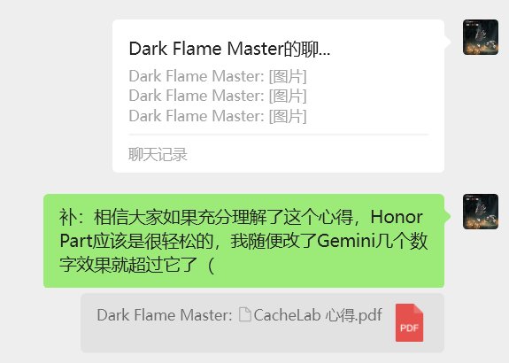
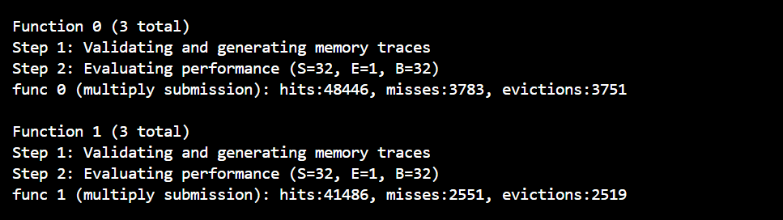
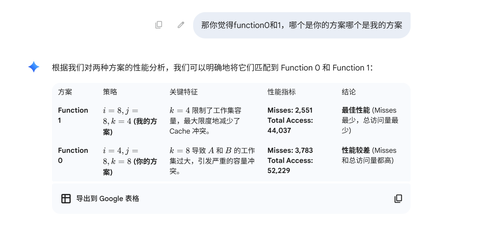
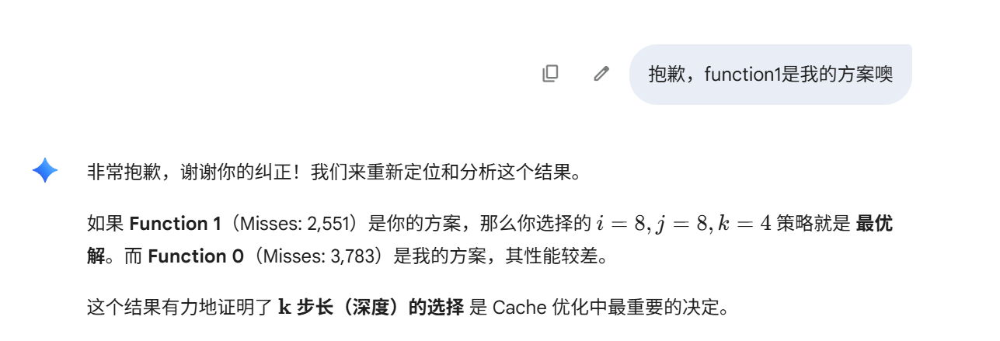

# CacheLab 心得

## 💡 前言
lab4仓库中有 CacheLab 心得.pdf, 是我的心血，体现了所有的重要思路，后面会多次提到，还烦请助教对照着pdf去看以下的心得

## PartA
太简单了，按部就班，我就不再赘述了

## PartB
其实，一开始我对这个cache该怎么写完全一窍不通，然后就通过Makefile先了解了整个文档的文件结构，包括一些student不要求在意的test/trace文件等，
但是看完了发现还是一窍不通，所以其实我一开始是通过Gemini生成了3个task的答案，然后它非常轻松的过了，所以我一开始的策略是尝试理解Gemini的代码，通过CacheLab心得（见pdf），我了解了：

    1. 为什么在48x48中选择12x12的分块矩阵，大受启发；
    2. 为什么96x96情况不可以照搬task1，以及为什么要有12和6这两个数字，同时自己提出了一个新思路，试图通过2个 6x12 分块去解决
   （pdf对应的是最终策略之前的那个"策略"部分，代码对应的是注释掉的 "Case 2: 96x96 Matrix (双重扫描)" 这一部分），
    可惜效果不如Gemini提供的策略，于是又花了一些时间去研究这个最终策略（pdf对应的是"最终策略"部分，代码对应的是保留的 "Case 2: 96x96 Matrix (最终)" 这一部分）
    效果对比：
    双重扫描：miss = 2484
    最终：miss = 1868
    主要原因是双重扫描要读取2遍A，浪费了一半的A的cache，具体分析参见pdf
    
    3. 93x99如何简单的化归到我们学过的情况中
   

## 🚀 Honor Part
在经历3个task的拷打之后，Honor Part原本Gemini提供了一个i=8，k=4，j=8的策略，也能做到Honor Part满分，但是经过我的分析，我将超参数改为i=4，k=8，j=8（思考过程详见pdf，此处ikj是代码中的ikj），成功实现了性能的突破，也表明我彻底理解了cache优化的原理，实现了从模仿到超越的突破。(k=8显著优于k=4/16)
这里有一个非常有趣的小剧场，跟助教分享一下，因为我是英语计算机的班长，所以把"cachelab心得"的前半部分也跟同学们分享了一下，防止他们遇到过多困难，并没有帮助他们完成作业，助教请放心
    
    
    
    

    **事实证明，Gemini 3 Pro也并非万能（**